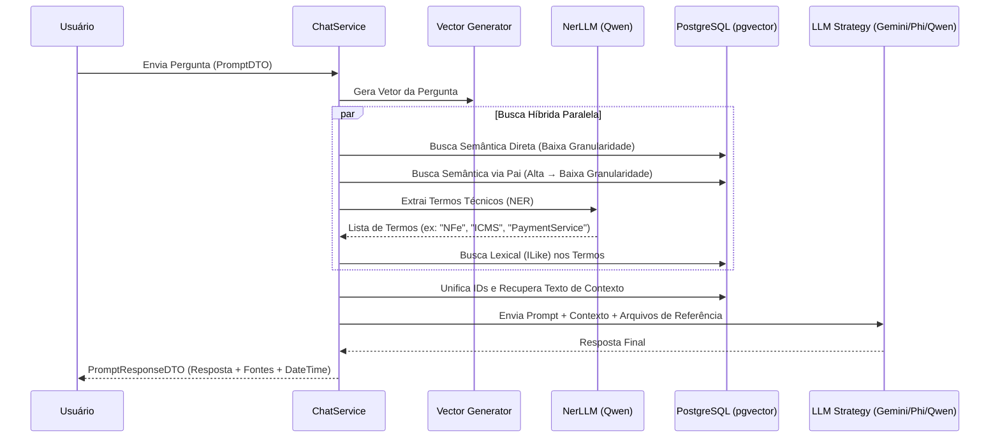

# 🤖 New.AI.Chat

Uma solução robusta de **RAG (Retrieval-Augmented Generation)** projetada para consulta e análise de documentação técnica e código-fonte, utilizando orquestração de IA moderna, busca híbrida avançada e armazenamento vetorial.

---

### 🔐 Notas sobre Autenticação e Swagger (desenvolvimento)

- A aplicação exige JWT Bearer para a maioria dos endpoints. A seção de configuração está em `JwtSettings` no `appsettings.json` (ou variáveis de ambiente/user secrets).
- O projeto aceita a chave do `JwtSettings:Key` em três formatos: Base64, hex (ex.: 64 chars hex) ou string simples (UTF-8). Tanto o middleware quanto o gerador de token usam a mesma lógica de decodificação.
- Para testes locais, há um script customizado do Swagger que adiciona uma pequena UI (campo + botões) para salvar um token em `localStorage` e injetá-lo nas requisições. Arquivo: `wwwroot/swagger-custom.js`. Este recurso é apenas para desenvolvimento.

Exemplo rápido (não comitar segredos reais):

```json
"JwtSettings": {
  "Key": "a31fc47b2d905e6b8b9adf4c3ed27af15b9c6093e2117a4db24f586a2cde7188",
  "Issuer": "New.AI.Chat",
  "Audience": "New.AI.Chat.Clients",
  "ExpirationMinutes": 60
}
```

Use `dotnet user-secrets` ou variáveis de ambiente (`JwtSettings__Key`) em desenvolvimento e um cofre (ex.: Azure Key Vault) em produção.

---

## 🧪 Testes

- Projeto de testes: `New.AI.Chat.Tests` (xUnit, Moq, FluentAssertions)
- Como executar: `dotnet test New.AI.Chat.Tests/New.AI.Chat.Tests.csproj`
- Estado atual (execução local durante alterações): 10 testes — 10 verdes.

---

## 📌 Mudanças detectadas / documentadas

- Adicionado `wwwroot/swagger-custom.js` para facilitar testes locais com Bearer token (UI leve). Documentado acima.
- `ConfigureAuthExtensions` passou a validar e decodificar a chave JWT (Base64/hex/UTF8) e a exigir chave mínima para evitar erros de assinatura.
- `AuthService` usa a mesma lógica de decodificação para garantir que tokens assinados localmente sejam válidos.

---

## 🇬🇧 English Version

### 📌 About the Project

`New.AI.Chat` allows ingesting documents and source code and querying them using natural language, producing answers via LLMs. The system combines vector semantic search, lexical search and entity extraction to improve answer precision.

### Authentication and Swagger notes (development)

- The API requires JWT Bearer for most endpoints. Configure `JwtSettings` in `appsettings.json`, user secrets or environment variables.
- The `JwtSettings:Key` accepts Base64, hex (e.g. 64-char hex) or plain UTF-8 string. Both the middleware and token generator decode the key the same way.
- For local testing a small Swagger helper script is provided to input a token and attach it to requests: `wwwroot/swagger-custom.js`. This is intended for development only.

Quick example (do not commit secrets):

```json
"JwtSettings": {
  "Key": "a31fc47b2d905e6b8b9adf4c3ed27af15b9c6093e2117a4db24f586a2cde7188",
  "Issuer": "New.AI.Chat",
  "Audience": "New.AI.Chat.Clients",
  "ExpirationMinutes": 60
}
```

### Tests

- Test project: `New.AI.Chat.Tests` (xUnit, Moq, FluentAssertions)
- Run: `dotnet test New.AI.Chat.Tests/New.AI.Chat.Tests.csproj`
- Current local run: 10 tests — all passing.

---

Se precisar, eu atualizo o README com instruções passo-a-passo para configurar `dotnet user-secrets`, exemplos de variáveis de ambiente e um pequeno trecho de troubleshooting do JWT (erros comuns como "The signature key was not found").


## 📌 Sobre o Projeto

O **New.AI.Chat** permite ingerir documentos e código-fonte e consultá-los via linguagem natural, com respostas geradas por LLMs. O sistema combina busca semântica vetorial, busca léxica e extração de entidades para maximizar a precisão das respostas.

---

## 🧩 Componentes

Este repositório contém dois componentes principais:

| Componente | Tipo | Descrição |
|---|---|---|
| **New.AI.Chat** | API ASP.NET Core | Gerencia recuperação de informações e geração de respostas com múltiplos LLMs |
| **New.AI.Ingestion.Client** | Console Application | Ferramenta CLI para ingestão em lote de arquivos com chunking e embeddings |

---

## 🧠 Conceitos Implementados

| Conceito | Descrição |
|---|---|
| **Parent-Child Chunking** | Dois níveis de granularidade: contexto macro (~800 tokens) e micro (~150 tokens) |
| **Hybrid Search** | Combina busca semântica (vetorial L2) e léxica (ILike) |
| **NER com LLM Leve** | Extração de termos técnicos via Qwen para enriquecer a busca léxica |
| **Strategy Pattern** | Suporte a múltiplos LLMs de forma intercambiável (Gemini, Phi, Qwen) |
| **Parallel Retrieval** | Execução paralela das estratégias de busca com `Task.WhenAll` |
| **Idempotência** | Verificação de duplicidade antes de reinserir documentos |
| **Vectorização em Batch** | Geração de embeddings em lote para maior eficiência |
| **Ingestão Paginada** | Envio em batches pelo cliente CLI para grandes volumes de arquivos |

---

## ⚙️ Fluxos de Funcionamento

### 1. Fluxo de Ingestão


**Destaques:**
- **Chunking Inteligente:** `TextChunker` do Semantic Kernel com overlap para manter coesão semântica
- **Hierarquia de Conhecimento:** Chunks grandes (baixa granularidade) contêm chunks pequenos (alta granularidade), permitindo buscas precisas com contexto rico
- **Idempotência:** Arquivos já existentes são ignorados com log de aviso

---

### 2. Fluxo de Chat (Hybrid RAG)



**Destaques:**
- **NER com modelo leve:** Qwen extrai termos técnicos antes da busca principal, compensando limitações da busca vetorial em nomes de métodos, classes e siglas específicas
- **Fusão de resultados:** IDs das 3 estratégias são unificados com deduplicação via `HashSet`
- **Rastreabilidade:** A resposta inclui os arquivos de referência utilizados para gerar o contexto

---

## 🏗️ Arquitetura e Tecnologias

### Backend — New.AI.Chat (API)

| Categoria | Tecnologia |
|---|---|
| Framework | .NET 10.0 / ASP.NET Core |
| Orquestração de IA | Microsoft Semantic Kernel 1.72 |
| Banco de Dados | PostgreSQL + pgvector |
| ORM | Entity Framework Core 10 + Npgsql |
| Documentação | Swagger / OpenAPI |
| Infraestrutura | Docker Compose |

**Modelos de IA suportados:**

| Função | Modelo | Provedor |
|---|---|---|
| Embeddings | `nomic-embed-text` | Ollama (local) |
| LLM Leve (NER) | `qwen2.5-coder:1.5b` | Ollama (local) |
| LLM Intermediário | `qwen2.5-coder:7b` | Ollama (local) |
| LLM Rápido | `phi3` | Ollama (local) |
| LLM Nuvem | Gemini 1.5 Flash | Google |

### Cliente de Ingestão — New.AI.Ingestion.Client (CLI)

- Console Application em .NET 10
- Varredura recursiva de diretórios
- Suporte a múltiplos formatos: `.cs`, `.pas`, e outros
- Envio paginado (batching) para a API

---

## 📁 Estrutura do Projeto

```
New.AI.Chat/
├── Controllers/        # Endpoints da API (Chat, Ingestion)
├── Services/           # Lógica de negócio
│   ├── ChatService.cs          # Pipeline RAG com busca híbrida
│   ├── IngestionService.cs     # Pipeline de ingestão e chunking
│   └── Interfaces/             # Contratos dos serviços
├── Models/             # Entidades do domínio
├── DTOs/               # Objetos de transferência de dados
├── Data/               # DbContext e configurações do EF Core
├── Extensions/         # Configurações de DI e Semantic Kernel
├── Enumerators/        # Enums (LLMEnum, etc.)
├── Migrations/         # Migrations do EF Core
├── Program.cs          # Entry point e configuração
├── appsettings.json    # Configurações da aplicação
└── docker-compose-database.yml  # Infraestrutura local
```

---

## 🚀 Como Executar

### Pré-requisitos

- [.NET 10 SDK](https://dotnet.microsoft.com/download/dotnet/10.0)
- [Docker](https://www.docker.com/)
- [Ollama](https://ollama.com/) rodando localmente
- Chave de API do Google Gemini (opcional, para o LLM de nuvem)

### 1. Clone o repositório

```bash
git clone https://github.com/cardosodearaujo/New.AI.Chat.git
cd New.AI.Chat
```

### 2. Suba o banco de dados

```bash
docker-compose -f docker-compose-database.yml up -d
```

### 3. Configure o Ollama

```bash
ollama pull nomic-embed-text
ollama pull phi3
ollama pull qwen2.5-coder:1.5b
ollama pull qwen2.5-coder:7b
```

### 4. Configure as variáveis de ambiente

No `appsettings.Development.json`:

```json
{
  "ConnectionStrings": {
    "DefaultConnection": "Host=localhost;Database=ragdb;Username=postgres;Password=sua-senha"
  },
  "AI": {
    "Gemini": {
      "ApiKey": "sua-chave-aqui"
    }
  }
}
```

### 5. Execute as migrations

```bash
dotnet ef database update
```

### 6. Execute a aplicação

```bash
dotnet run
```

Acesse a documentação Swagger em: `https://localhost:{porta}/swagger`

---

## 📡 Endpoints

### Ingestão de Documentos

```http
POST /api/ingestion
Content-Type: application/json

{
  "ingestionFiles": [
    {
      "fileName": "PaymentService.cs",
      "format": "cs",
      "size": 2048,
      "contentText": "<conteúdo em Base64>"
    }
  ]
}
```

### Chat

```http
POST /api/chat
Content-Type: application/json

{
  "message": "O que faz a classe PaymentService?",
  "llm": 1
}
```

**Resposta:**
```json
{
  "response": "A classe PaymentService é responsável por...",
  "referenceFiles": ["PaymentService.cs", "IPaymentService.cs"],
  "dateTime": "25/03/2026 10:30:00"
}
```

---

## 🔐 Autenticação (JWT)

Foi adicionada autenticação via Bearer token (JWT) para proteger todos os endpoints.

- Endpoint de login: `POST /api/auth/login`
  - Payload: `{ "username": "string", "password": "string" }`
  - Resposta: `{ "token": "<jwt>", "expiresAt": "<iso-date>" }`
  - Observação: o endpoint de login está marcado com `[AllowAnonymous]`; todos os demais endpoints exigem autenticação por padrão (política global).

- Implementação inicial: usuários em memória (apenas para desenvolvimento):
  - `admin` / `P@ssw0rd`
  - `user` / `password`

- Configuração (`appsettings.json` ou variáveis de ambiente): seção `JwtSettings` com as propriedades `Key`, `Issuer`, `Audience` e `ExpirationMinutes`.

Exemplo:

```json
"JwtSettings": {
  "Key": "uma-chave-muito-longa-e-secreta-mude-em-producao",
  "Issuer": "New.AI.Chat",
  "Audience": "New.AI.Chat.Clients",
  "ExpirationMinutes": 60
}
```

Em produção, substitua o backend de autenticação (usuários em memória) por Identity, banco de dados ou provedor OAuth/OpenID Connect.

---

## 🧪 Projeto de Testes

Foi adicionado um projeto de testes `New.AI.Chat.Tests` com cobertura unitária dos controllers e testes de integração leves para validar o pipeline de autenticação e endpoints protegidos.

Principais pontos:
- Frameworks: `xUnit`, `Moq`, `FluentAssertions`, `Microsoft.AspNetCore.Mvc.Testing`.
- Testes incluídos:
  - Unitários dos controllers: `AuthController`, `ChatController`, `IngestionController`, `FileController`.
  - Integração leve: valida fluxo de autenticação e chamadas protegidas (usa `WebApplicationFactory<Program>` e um `Test` authentication scheme para isolar validação JWT durante os testes).

Como executar os testes:

```bash
dotnet test New.AI.Chat.Tests/New.AI.Chat.Tests.csproj
```

Os testes usam mocks para substituir dependências pesadas (DB, kernel, serviços externos) garantindo execução rápida e determinística.

Observação: há avisos de conflito de versões do EF Core nas saídas — isso não impede os testes atuais (que usam mocks), mas é recomendado alinhar versões caso deseje testes que usem `AIDbContext` real com `InMemory`.

---

## 🗺️ Roadmap

- [ ] Tornar parâmetros de chunking configuráveis via `appsettings`
- [ ] Implementar reranking por consenso entre estratégias de busca
- [ ] Adicionar limite de tokens no contexto enviado ao LLM
- [ ] Suporte a atualização de documentos já ingeridos
- [ ] Testes unitários e de integração
- [ ] Avaliar qualidade das respostas com RAGAS
- [ ] Deploy via Docker completo (app + banco)
- [ ] Suporte a novos formatos: PDF, Markdown, JSON

---

## 👨‍💻 Autor

**Everaldo Cardoso de Araújo**
- [Github](https://github.com/cardosodearaujo)
- [Likedin](https://www.linkedin.com/in/everaldoaraujo)

---

## 📄 Licença

Este projeto está sob a licença MIT. Veja o arquivo [LICENSE](LICENSE) para mais detalhes.

---

*Desenvolvido com foco em alta performance e precisão na recuperação de informações técnicas.*
