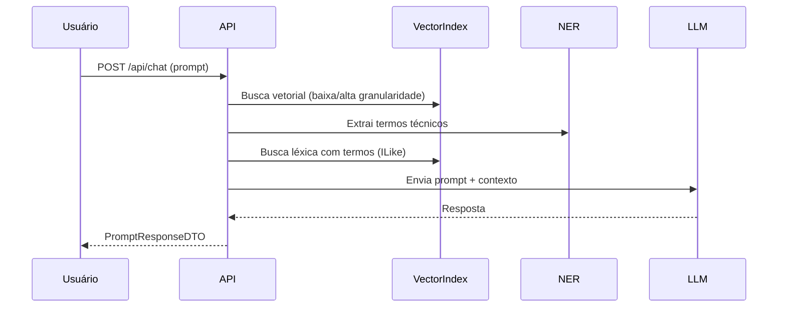

# New.AI.Chat

Uma implementação de RAG (Retrieval-Augmented Generation) orientada a consultas sobre código e documentação técnica. Fornece APIs para ingestão de conteúdo, indexação vetorial e um endpoint de chat que compõe contexto retrieval + LLM.

Índice
- Sobre
- Estrutura do repositório
- Pré-requisitos
- Configuração (JWT, DB, AI)
- Execução (local)
- Swagger / Autenticação para testes locais
- Testes
- Arquitetura (diagramas)
- Boas práticas e segurança
- Contribuição e licença

-----------------------------------------------------------------

🇧🇷 **Sobre**

`New.AI.Chat` é uma API em .NET 10 que combina:
- Ingestão e chunking de documentos;
- Indexação vetorial (pgvector + PostgreSQL);
- Busca híbrida (vetorial + léxica) e NER para melhorar recall em termos técnicos;
- Orquestração de strategies de LLM para geração de respostas.

Objetivo: permitir consultas em linguagem natural sobre código e documentos com fontes rastreáveis.

**Estrutura do repositório**
- `New.AI.Chat/` — API ASP.NET Core (entrada principal).
- `New.AI.Ingestion.Client/` — CLI para ingestão em lote.
- `New.AI.Chat.Tests/` — testes unitários e integração leve.

Arquivos importantes:
- `Program.cs` — composição da aplicação (DI, middlewares, Swagger).
- `Extensions/ConfigureAuthExtensions.cs` — configuração JWT.
- `wwwroot/swagger-custom.js` — helper dev para inserir token no Swagger UI (apenas em dev).
- `appsettings.json` — configurações base (não coloque segredos reais aqui).

**Pré-requisitos**
--------------
- [.NET 10 SDK](https://dotnet.microsoft.com/download/dotnet/10.0)
- [Docker](https://www.docker.com/) (para PostgreSQL/pgvector)
- (Opcional) Ollama ou outro runtime de modelos para executar localmente os LLMs usados em dev

**Configuração**
------------
**JWT (importante):**
- A aplicação lê `JwtSettings` da configuração. A chave de assinatura (`Key`) pode ser fornecida como:
  - Base64, ou
  - Hex (string de bytes em hexadecimal), ou
  - String UTF-8 (não recomendado para produção sem entropia suficiente).
- Em desenvolvimento use `dotnet user-secrets` ou variáveis de ambiente (`JwtSettings__Key`) e nunca comite segredos no repositório.

**Banco de dados:**
- Use o `docker-compose-database.yml` para executar PostgreSQL com pgvector.
- Execute migrations com `dotnet ef database update` a partir do projeto `New.AI.Chat`.

**Execução local**
--------------
1. Clone e entre na pasta do repositório.
2. Subir DB (opcional local):
   ```bash
   docker-compose -f docker-compose-database.yml up -d
   ```
3. Configurar segredos (exemplo):
   ```bash
   dotnet user-secrets set "JwtSettings:Key" "<sua-chave-secreta>" --project New.AI.Chat
   dotnet user-secrets set "JwtSettings:Issuer" "New.AI.Chat" --project New.AI.Chat
   dotnet user-secrets set "JwtSettings:Audience" "New.AI.Chat.Clients" --project New.AI.Chat
   ```
4. Migrar base de dados (se aplicável):
   ```bash
   dotnet ef database update --project New.AI.Chat
   ```
5. Executar:
   ```bash
   dotnet run --project New.AI.Chat
   ```

**Swagger / Autenticação para testes locais**
----------------------------------------
- O projeto exige JWT Bearer por padrão (política global). O endpoint de login está marcado como `AllowAnonymous`.
- Para facilitar testes locais, incluímos um helper em `wwwroot/swagger-custom.js` que adiciona um pequeno UI ao Swagger para inserir um token e anexá-lo nas requisições. Este helper:
  - não persiste segredos no repositório (use localStorage apenas para dev);
  - não deve ser usado em ambientes de produção.

**Uso típico no Swagger:**
1. Inicie a API em modo Development.
2. Abra a UI Swagger (raiz do app).
3. Clique no botão `Authorize` adicionado na topbar, cole o JWT retornado pelo endpoint de login e clique em `Set token`.

**Testes**
------
- Projeto de testes: `New.AI.Chat.Tests` (xUnit, Moq, FluentAssertions).
- Executar todos os testes:
  ```bash
  dotnet test New.AI.Chat.Tests/New.AI.Chat.Tests.csproj
  ```
- Resultado (local): todos os testes unitários e integração leve passam após as alterações.

**Arquitetura — visão rápida**
-------------------------
Fluxo de ingestão (simplificado):

```mermaid
flowchart TB
  A[Cliente CLI / API] --> B[IngestionService]
  B --> C{Validação}
  C -- Valido --> D[Chunking - macro e micro]
  D --> E[Embeddings (nomic/local)]
  E --> F[Persistência - Postgres + pgvector]
```

Fluxo de consulta (RAG hybrid):



**Boas práticas e segurança**
-------------------------
- Não comitar chaves ou segredos em `appsettings.json`.
- Use `dotnet user-secrets` em dev e um cofre (ex.: Azure Key Vault) em produção.
- Geração de chave: use 32 bytes de entropia (Base64 ou hex) para `JwtSettings:Key`.
- Habilite `RequireHttpsMetadata = true` em produção no JWT bearer options.

**Contribuição e licença**
----------------------
- Fork, branch com prefixo `feature/` e envie PR para revisão.
- Branch atual com minhas alterações: `feature/add-swagger-auth-jwt`.
- Licença: MIT.

-----------------------------------------------------------------

🇬🇧 **English Version**

**Overview**
--------
`New.AI.Chat` is a .NET 10 API implementing a RAG pipeline for querying code and technical documentation. It supports ingestion, vector indexing, hybrid retrieval and LLM-based answer generation.

**Repository layout**
-----------------
- `New.AI.Chat/` — ASP.NET Core API (main app).
- `New.AI.Ingestion.Client/` — CLI for batch ingestion.
- `New.AI.Chat.Tests/` — unit and light integration tests.

**Quick start**
-----------
**Prerequisites:** .NET 10 SDK, Docker (Postgres + pgvector), optional local model runtime (Ollama).

**Run locally:**
1. Start DB:
   ```bash
   docker-compose -f docker-compose-database.yml up -d
   ```
2. Set secrets (recommended):
   ```bash
   dotnet user-secrets set "JwtSettings:Key" "<your-secret>" --project New.AI.Chat
   ```
3. Apply migrations:
   ```bash
   dotnet ef database update --project New.AI.Chat
   ```
4. Run:
   ```bash
   dotnet run --project New.AI.Chat
   ```

**Authentication & Swagger (dev)**
-----------------------------
- The API requires JWT Bearer for most endpoints; login endpoint is anonymous.
- For dev/testing the project includes `wwwroot/swagger-custom.js` which injects a lightweight authorize UI into Swagger and attaches the `Authorization` header to outgoing requests. Do not use this helper in production.

**Testing**
-------
- Tests live in `New.AI.Chat.Tests` (xUnit, Moq, FluentAssertions).
- Run:
  ```bash
  dotnet test New.AI.Chat.Tests/New.AI.Chat.Tests.csproj
  ```

**Architecture diagrams**
---------------------
(See mermaid diagrams above showing ingestion and chat pipelines.)

**Security notes**
--------------
- Never commit secrets. Use user-secrets or environment variables for local development and a secret manager in production.
- Use strong signing keys for JWT (32 bytes entropy recommended).
- Ensure HTTPS and secure cookie/configuration in production.

**Contributing**
------------
- Create feature branches and open PRs against `main`.
- Tests should pass locally before opening PR.

**License**
-------
MIT


---

If you want, I can also:
- Add step-by-step `dotnet user-secrets` examples to the README (no secrets included),
- Provide a short troubleshooting section for common JWT errors (e.g., signature key missing),
- Generate a ready-to-open PR description template summarizing changes made on the current feature branch.
