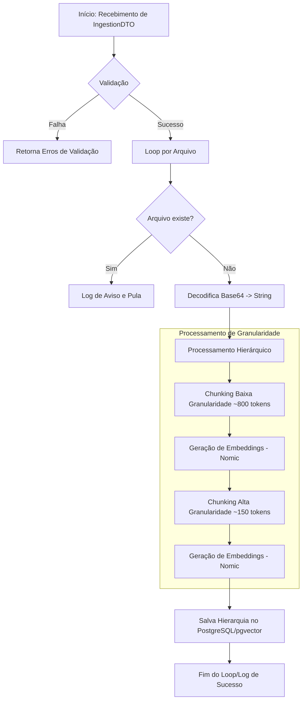
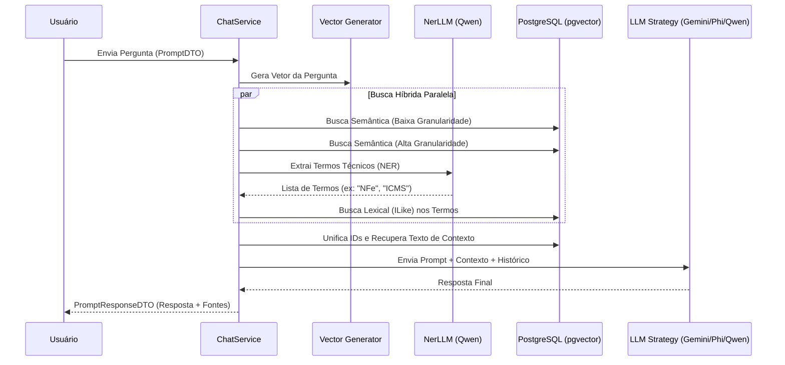

# New.AI.Chat & Ingestion Client

Uma solução robusta de **RAG (Retrieval-Augmented Generation)** projetada para consulta e análise de documentação técnica e código-fonte, utilizando orquestração de IA moderna e armazenamento vetorial.

## 🚀 Visão Geral

Este repositório contém dois componentes principais:
1.  **New.AI.Chat (API):** Um serviço backend em ASP.NET Core que gerencia a recuperação de informações e a geração de respostas usando múltiplos modelos de linguagem (LLMs).
2.  **New.AI.Ingestion.Client (CLI):** Uma ferramenta de console para ingestão em lote de arquivos, realizando o pré-processamento, chunking e geração de embeddings.

---

## ⚙️ Fluxos de Funcionamento

O coração do projeto reside na separação clara entre a preparação dos dados (**Ingestão**) e a consulta inteligente (**Chat**).

### 1. Fluxo de Ingestão (IngestionService)
Este fluxo transforma arquivos brutos em uma estrutura de conhecimento hierárquica e vetorial.



**Detalhes do Processo:**
- **Chunking Inteligente:** Utiliza o `TextChunker` do Semantic Kernel com sobreposição (overlap) para manter a coesão semântica.
- **Hierarquia:** Cada arquivo é decomposto em blocos de "Baixa Granularidade" (contexto macro) que contêm vários blocos de "Alta Granularidade" (contexto micro), permitindo buscas mais precisas e contextualizadas.

---

### 2. Fluxo de Chat (ChatService)
O fluxo de chat utiliza uma estratégia de busca híbrida e multimodelo para garantir que o LLM receba o contexto mais relevante.



**Destaques da Recuperação:**
- **Extração de Entidades (NER):** Antes da busca principal, um modelo leve identifica termos técnicos para realizar uma busca lexical, compensando possíveis limitações da busca vetorial em nomes de métodos ou siglas específicas.
- **Deduplicação:** Os resultados das buscas semântica e lexical são unificados para evitar redundância no contexto enviado ao modelo final.

---

## 🏗️ Arquitetura e Tecnologias

### Backend (New.AI.Chat)
*   **Framework:** .NET 10.0 (ASP.NET Core)
*   **Orquestração de IA:** [Microsoft Semantic Kernel](https://github.com/microsoft/semantic-kernel)
*   **Banco de Dados:** PostgreSQL com extensão [pgvector](https://github.com/pgvector/pgvector)
*   **Modelos de IA Suportados:**
    *   **Embeddings:** `nomic-embed-text` (via Ollama)
    *   **LLMs Locais (Ollama):** Phi-3, Qwen 2.5 Coder (1.5B e 7B)
    *   **LLMs Nuvem:** Google Gemini 1.5 Flash
*   **Padrões de Projeto:** Strategy Pattern para alternância dinâmica de LLMs e Injeção de Dependência.

### Cliente de Ingestão (New.AI.Ingestion.Client)
*   **Tipo:** Console Application (.NET 10.0)
*   **Funcionalidade:** Varredura recursiva de diretórios, leitura de arquivos (suporta `.cs`, `.pas`, etc.) e envio paginado (batching) para a API.

---

## 🛠️ Configuração e Instalação

### Pré-requisitos
*   [.NET 10 SDK](https://dotnet.microsoft.com/download/dotnet/10.0)
*   [PostgreSQL](https://www.postgresql.org/) com [pgvector](https://github.com/pgvector/pgvector-dotnet) instalado.
*   [Ollama](https://ollama.com/) rodando localmente (para modelos locais).

### Configuração do Banco de Dados
1.  Crie um banco de dados chamado `ragdb`.
2.  Configure a string de conexão no `appsettings.json` do projeto `New.AI.Chat`.
3.  Execute as migrações do Entity Framework:
    ```bash
    dotnet ef database update
    ```

### Configuração do Ollama
```bash
ollama pull nomic-embed-text
ollama pull phi3
ollama pull qwen2.5-coder:1.5b
ollama pull qwen2.5-coder:7b
```

---
Desenvolvido com foco em alta performance e precisão na recuperação de informações técnicas.
