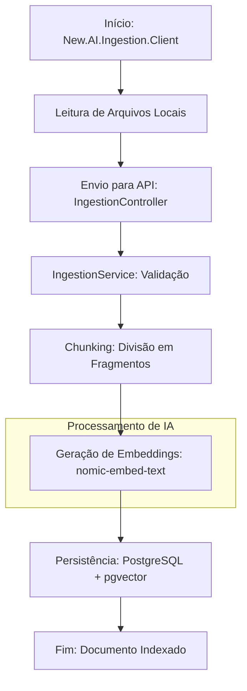
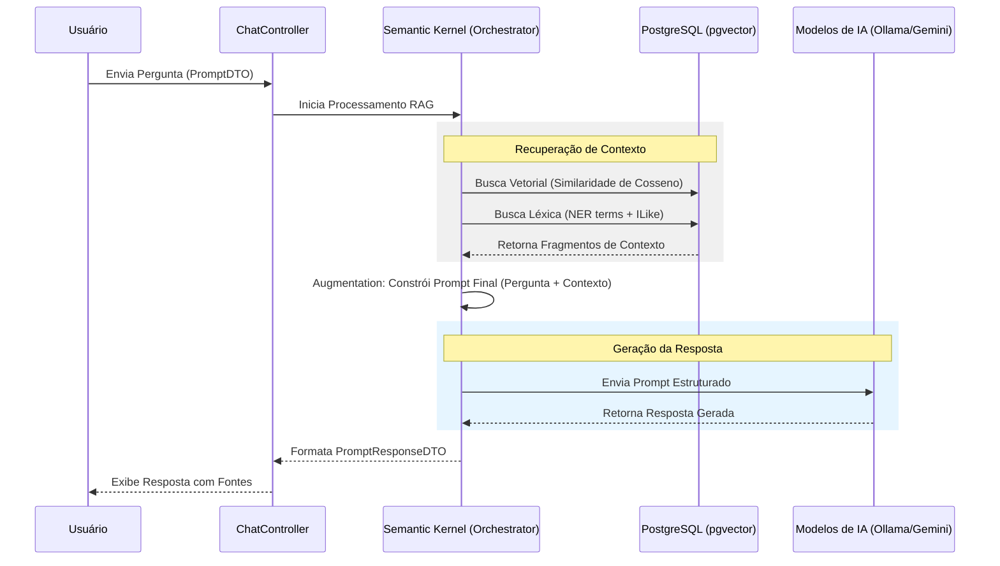

# New.AI.Chat - Sistema RAG (Retrieval-Augmented Generation)

Este repositório contém uma implementação robusta de um pipeline **RAG (Retrieval-Augmented Generation)** desenvolvido em **.NET 10**. O sistema é projetado para permitir consultas inteligentes sobre bases de conhecimento (documentação técnica e código-fonte), utilizando orquestração de múltiplos modelos de IA e busca vetorial híbrida.

---

## 📖 Sumário
1. [Visão Geral](#visão-geral)
2. [Arquitetura do Sistema](#arquitetura-do-sistema)
3. [Stack Tecnológica](#stack-tecnológica)
4. [Estrutura do Projeto](#estrutura-do-projeto)
5. [Configuração do Ambiente](#configuração-do-ambiente)
6. [Guia de Uso (API)](#guia-de-uso-api)
7. [Ingestão de Dados (CLI)](#ingestão-de-dados-cli)
8. [Testes](#testes)
9. [Segurança](#segurança)

---

## 1. Visão Geral
O **New.AI.Chat** resolve o problema de "alucinação" de LLMs comuns ao fornecer contexto relevante extraído de uma base de dados proprietária antes de gerar a resposta. 

### Principais Diferenciais:
- **Busca Híbrida:** Combina similaridade vetorial (pgvector) com busca léxica e extração de entidades (NER).
- **Estratégia Multi-LLM:** Permite alternar entre modelos locais (Ollama) e nuvem (Google Gemini).
- **Hierarquia de Documentos:** Armazena fragmentos de texto em diferentes granularidades (Alta/Baixa) para otimizar a precisão da recuperação.

---

## 2. Arquitetura do Sistema

O sistema é dividido em dois grandes pipelines: **Ingestão** (preparação dos dados) e **Consulta/Chat** (recuperação e geração).

### 📊 Fluxos de Funcionamento

#### A. Fluxo de Ingestão de Dados
Este fluxo descreve como um documento físico é transformado em conhecimento vetorial dentro do banco de dados.



#### B. Fluxo de Consulta RAG (Retrieval-Augmented Generation)
Este fluxo detalha a inteligência por trás do chat, desde a pergunta do usuário até a resposta enriquecida com contexto.



---

## 3. Stack Tecnológica
- **Linguagem:** C# (.NET 10)
- **Framework Web:** ASP.NET Core
- **Orquestrador de IA:** Microsoft Semantic Kernel
- **Banco de Dados:** PostgreSQL 16 + pgvector
- **ORM:** Entity Framework Core
- **Provedores de IA:** 
  - **Google AI:** Gemini 1.5/2.5 Flash
  - **Ollama (Local):** Phi-3, Qwen 2.5, Nomic-Embed-Text
- **Documentação:** Swagger (OpenAPI)

---

## 4. Estrutura do Projeto
- `New.AI.Chat/`: Core da aplicação (Web API).
  - `Controllers/`: Endpoints da API.
  - `Data/`: Contexto do banco, mappings e migrações.
  - `Services/`: Lógica de negócio e estratégias de LLM.
  - `Extensions/`: Configurações de DI, Auth e IA.
- `New.AI.Ingestion.Client/`: Ferramenta CLI para processamento de arquivos em lote.
- `New.AI.Chat.Tests/`: Testes unitários e de integração (xUnit).

---

## 5. Configuração do Ambiente

### 5.1. Banco de Dados (Docker)
Suba o container do PostgreSQL com suporte a vetores:
```bash
docker-compose -f New.AI.Chat/docker-compose-database.yml up -d
```

### 5.2. IA Local (Ollama)
Certifique-se de ter o Ollama instalado e os modelos baixados:
```bash
ollama pull phi3
ollama pull qwen2.5-coder:1.5b
ollama pull qwen2.5-coder:7b
ollama pull nomic-embed-text
```

### 5.3. Configuração de Segredos
No diretório `New.AI.Chat/`, configure as chaves necessárias:
```bash
# Chave do Google Gemini (se for usar)
dotnet user-secrets set "AI:Google:ApiKey" "SUA_CHAVE_AQUI"

# Chave de Assinatura JWT
dotnet user-secrets set "JwtSettings:Key" "UMA_STRING_LONGA_E_SEGURA_AQUI"
```

### 5.4. Migrações do Banco
```bash
dotnet ef database update --project New.AI.Chat
```

---

## 6. Guia de Uso (API)

### Autenticação
A API utiliza JWT. Primeiro, obtenha o token:
- **POST** `/api/Auth/login`
- **Body:** `{ "username": "admin", "password": "..." }`

### Chat / Consultas
- **POST** `/api/Chat`
- **Body:**
```json
{
  "message": "Como funciona o sistema de autenticação deste projeto?",
  "llm": 0  // 0: Gemini, 1: Phi3, 2: Qwen1.5, 3: Qwen7b
}
```

---

## 7. Ingestão de Dados (CLI)
Para alimentar o sistema com novos documentos:
1. Execute o projeto `New.AI.Ingestion.Client`.
2. Informe o caminho da pasta contendo os documentos.
3. O sistema irá ler, fragmentar e indexar automaticamente no banco de dados.

---

## 8. Testes
O projeto conta com uma suíte de testes para garantir a estabilidade do pipeline RAG.
```bash
dotnet test
```

---

## 9. Segurança
- **JWT:** Proteção de todos os endpoints sensíveis.
- **Configuração:** Uso estrito de `appsettings.json` para valores padrão e `user-secrets` para dados sensíveis.
- **Swagger:** Customizado para suportar autenticação Bearer diretamente na interface de testes em ambiente de desenvolvimento.

---
*Este projeto é uma demonstração técnica de alto nível da aplicação de IA Generativa em ambientes corporativos.*
