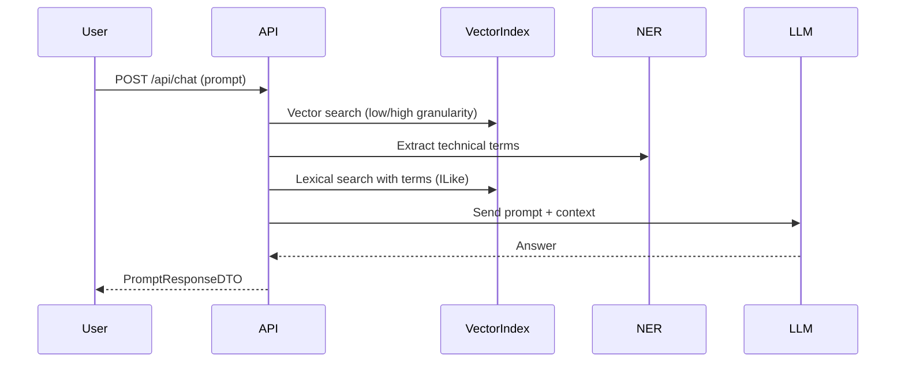

# 🚀 New.AI.Chat - RAG Pipeline & AI Orchestrator

<<<<<<< Updated upstream
Uma implementação de RAG (Retrieval-Augmented Generation) orientada a consultas sobre código e documentação técnica. Fornece APIs para ingestão de conteúdo, indexação vetorial e um endpoint de chat que compõe contexto retrieval + LLM.

Índice
- Sobre
- Estrutura do repositório
- Pré-requisitos
- Configuração (JWT, DB, AI)
- Execução (local)
- Swagger / Autenticação para testes locais
- Testes
- Arquitetura (diagramas)
- Boas práticas e segurança
- Contribuição e licença

-----------------------------------------------------------------

🇧🇷 **Sobre**

`New.AI.Chat` é uma API em .NET 10 que combina:
- Ingestão e chunking de documentos;
- Indexação vetorial (pgvector + PostgreSQL);
- Busca híbrida (vetorial + léxica) e NER para melhorar recall em termos técnicos;
- Orquestração de strategies de LLM para geração de respostas.

Objetivo: permitir consultas em linguagem natural sobre código e documentos com fontes rastreáveis.

**Estrutura do repositório**
- `New.AI.Chat/` — API ASP.NET Core (entrada principal).
- `New.AI.Ingestion.Client/` — CLI para ingestão em lote.
- `New.AI.Chat.Tests/` — testes unitários e integração leve.

Arquivos importantes:
- `Program.cs` — composição da aplicação (DI, middlewares, Swagger).
- `Extensions/ConfigureAuthExtensions.cs` — configuração JWT.
- `wwwroot/swagger-custom.js` — helper dev para inserir token no Swagger UI (apenas em dev).
- `appsettings.json` — configurações base (não coloque segredos reais aqui).

**Pré-requisitos**
--------------
- [.NET 10 SDK](https://dotnet.microsoft.com/download/dotnet/10.0)
- [Docker](https://www.docker.com/) (para PostgreSQL/pgvector)
- (Opcional) Ollama ou outro runtime de modelos para executar localmente os LLMs usados em dev

**Configuração**
------------
**JWT (importante):**
- A aplicação lê `JwtSettings` da configuração. A chave de assinatura (`Key`) pode ser fornecida como:
  - Base64, ou
  - Hex (string de bytes em hexadecimal), ou
  - String UTF-8 (não recomendado para produção sem entropia suficiente).
- Em desenvolvimento use `dotnet user-secrets` ou variáveis de ambiente (`JwtSettings__Key`) e nunca comite segredos no repositório.

**Banco de dados:**
- Use o `docker-compose-database.yml` para executar PostgreSQL com pgvector.
- Execute migrations com `dotnet ef database update` a partir do projeto `New.AI.Chat`.

**Execução local**
--------------
1. Clone e entre na pasta do repositório.
2. Subir DB (opcional local):
   ```bash
   docker-compose -f docker-compose-database.yml up -d
   ```
3. Configurar segredos (exemplo):
   ```bash
   dotnet user-secrets set "JwtSettings:Key" "<sua-chave-secreta>" --project New.AI.Chat
   dotnet user-secrets set "JwtSettings:Issuer" "New.AI.Chat" --project New.AI.Chat
   dotnet user-secrets set "JwtSettings:Audience" "New.AI.Chat.Clients" --project New.AI.Chat
   ```
4. Migrar base de dados (se aplicável):
   ```bash
   dotnet ef database update --project New.AI.Chat
   ```
5. Executar:
   ```bash
   dotnet run --project New.AI.Chat
   ```

**Swagger / Autenticação para testes locais**
----------------------------------------
- O projeto exige JWT Bearer por padrão (política global). O endpoint de login está marcado como `AllowAnonymous`.
- Para facilitar testes locais, incluímos um helper em `wwwroot/swagger-custom.js` que adiciona um pequeno UI ao Swagger para inserir um token e anexá-lo nas requisições. Este helper:
  - não persiste segredos no repositório (use localStorage apenas para dev);
  - não deve ser usado em ambientes de produção.

**Uso típico no Swagger:**
1. Inicie a API em modo Development.
2. Abra a UI Swagger (raiz do app).
3. Clique no botão `Authorize` adicionado na topbar, cole o JWT retornado pelo endpoint de login e clique em `Set token`.

**Testes**
------
- Projeto de testes: `New.AI.Chat.Tests` (xUnit, Moq, FluentAssertions).
- Executar todos os testes:
  ```bash
  dotnet test New.AI.Chat.Tests/New.AI.Chat.Tests.csproj
  ```
- Resultado (local): todos os testes unitários e integração leve passam após as alterações.

**Arquitetura — visão rápida**
-------------------------
Fluxo de ingestão (simplificado):

```mermaid
graph TD
  Client[Client CLI / API] --> Ingestion[IngestionService]
  Ingestion --> Validation{Validation}
  Validation -- valid --> Chunking[Chunking - macro and micro]
  Chunking --> Embeddings[Embeddings (nomic/local)]
  Embeddings --> Persistence[Persistence (Postgres + pgvector)]
```

Fluxo de consulta (RAG hybrid):



**Boas práticas e segurança**
-------------------------
- Não comitar chaves ou segredos em `appsettings.json`.
- Use `dotnet user-secrets` em dev e um cofre (ex.: Azure Key Vault) em produção.
- Geração de chave: use 32 bytes de entropia (Base64 ou hex) para `JwtSettings:Key`.
- Habilite `RequireHttpsMetadata = true` em produção no JWT bearer options.

**Contribuição e licença**
----------------------
- Fork, branch com prefixo `feature/` e envie PR para revisão.
- Branch atual com minhas alterações: `feature/add-swagger-auth-jwt`.
- Licença: MIT.

-----------------------------------------------------------------

🇬🇧 **English Version**

**Overview**
--------
`New.AI.Chat` is a .NET 10 API implementing a RAG pipeline for querying code and technical documentation. It supports ingestion, vector indexing, hybrid retrieval and LLM-based answer generation.

**Repository layout**
-----------------
- `New.AI.Chat/` — ASP.NET Core API (main app).
- `New.AI.Ingestion.Client/` — CLI for batch ingestion.
- `New.AI.Chat.Tests/` — unit and light integration tests.

**Quick start**
-----------
**Prerequisites:** .NET 10 SDK, Docker (Postgres + pgvector), optional local model runtime (Ollama).

**Run locally:**
1. Start DB:
   ```bash
   docker-compose -f docker-compose-database.yml up -d
   ```
2. Set secrets (recommended):
   ```bash
   dotnet user-secrets set "JwtSettings:Key" "<your-secret>" --project New.AI.Chat
   ```
3. Apply migrations:
   ```bash
   dotnet ef database update --project New.AI.Chat
   ```
4. Run:
   ```bash
   dotnet run --project New.AI.Chat
   ```

**Authentication & Swagger (dev)**
-----------------------------
- The API requires JWT Bearer for most endpoints; login endpoint is anonymous.
- For dev/testing the project includes `wwwroot/swagger-custom.js` which injects a lightweight authorize UI into Swagger and attaches the `Authorization` header to outgoing requests. Do not use this helper in production.

**Testing**
-------
- Tests live in `New.AI.Chat.Tests` (xUnit, Moq, FluentAssertions).
- Run:
  ```bash
  dotnet test New.AI.Chat.Tests/New.AI.Chat.Tests.csproj
  ```

**Architecture diagrams**
---------------------
(See mermaid diagrams above showing ingestion and chat pipelines.)

**Security notes**
--------------
- Never commit secrets. Use user-secrets or environment variables for local development and a secret manager in production.
- Use strong signing keys for JWT (32 bytes entropy recommended).
- Ensure HTTPS and secure cookie/configuration in production.

**Contributing**
------------
- Create feature branches and open PRs against `main`.
- Tests should pass locally before opening PR.

**License**
-------
MIT
=======
[](https://dotnet.microsoft.com/download/dotnet/10.0)
[](https://www.postgresql.org/)
[](https://github.com/microsoft/semantic-kernel)
[](https://opensource.org/licenses/MIT)
>>>>>>> Stashed changes

`New.AI.Chat` é uma solução avançada de **RAG (Retrieval-Augmented Generation)** projetada para consultas inteligentes sobre bases de conhecimento técnicas, código-fonte e documentação. A plataforma utiliza orquestração multi-modelo (LLMs) e busca vetorial híbrida para fornecer respostas precisas com rastreabilidade de fontes.

---

## 🇧🇷 Português

### 🌟 Destaques
- **Hybrid Retrieval:** Combina busca vetorial (pgvector) com técnicas de NER (Named Entity Recognition) para melhor recall técnico.
- **Multi-LLM Strategy:** Suporte a múltiplos modelos via Semantic Kernel (Gemini 2.5, Phi-3, Qwen 2.5).
- **Ingestão Granular:** Processamento hierárquico de documentos (Alta/Baixa granularidade) para contextos otimizados.
- **Modern Stack:** Desenvolvido com as últimas tecnologias .NET 10 e Entity Framework Core.

### 🏗️ Arquitetura
A aplicação é dividida em três componentes principais:
1. **New.AI.Chat (API):** O core da aplicação, responsável pelo processamento RAG, gestão vetorial e endpoints de chat.
2. **New.AI.Ingestion.Client (CLI):** Ferramenta utilitária para ingestão em lote de arquivos locais.
3. **New.AI.Chat.Tests:** Suíte de testes automatizados para garantir a integridade do pipeline.

### 🚀 Como Começar

#### Pré-requisitos
- [.NET 10 SDK](https://dotnet.microsoft.com/download/dotnet/10.0)
- [Docker Desktop](https://www.docker.com/products/docker-desktop/)
- [Ollama](https://ollama.ai/) (para modelos locais como Phi-3 e Qwen)

#### 1. Configurar Infraestrutura (Docker)
```bash
docker-compose -f New.AI.Chat/docker-compose-database.yml up -d
```

#### 2. Configurar Segredos e Variáveis
Configure sua chave de API do Google Gemini (necessária para o modelo `gemini-2.5-flash`):
```bash
dotnet user-secrets set "AI:Google:ApiKey" "SUA_CHAVE_AQUI" --project New.AI.Chat
dotnet user-secrets set "JwtSettings:Key" "UMA_CHAVE_FORTE_BASE64_OU_HEX" --project New.AI.Chat
```

#### 3. Executar Migrations
```bash
dotnet ef database update --project New.AI.Chat
```

#### 4. Rodar a API
```bash
dotnet run --project New.AI.Chat
```

### 🛠️ Configuração de Modelos (Ollama)
A API espera os seguintes modelos rodando localmente via Ollama (porta 11434):
- `phi3`
- `qwen2.5-coder:1.5b`
- `qwen2.5-coder:7b`
- `nomic-embed-text` (para embeddings)

---

## 🇬🇧 English

### 🌟 Key Features
- **Hybrid Retrieval:** Combines vector search (pgvector) with NER (Named Entity Recognition) for improved technical recall.
- **Multi-LLM Strategy:** Support for multiple models via Semantic Kernel (Gemini 2.5, Phi-3, Qwen 2.5).
- **Granular Ingestion:** Hierarchical document processing (High/Low granularity) for optimized context.
- **Modern Stack:** Built with the latest .NET 10 technologies and Entity Framework Core.

### 🏗️ Architecture
The project is structured into three main components:
1. **New.AI.Chat (API):** The core engine handling RAG processing, vector management, and chat endpoints.
2. **New.AI.Ingestion.Client (CLI):** Batch utility for ingesting local files into the system.
3. **New.AI.Chat.Tests:** Automated testing suite for pipeline integrity.

### 🚀 Getting Started

#### Prerequisites
- [.NET 10 SDK](https://dotnet.microsoft.com/download/dotnet/10.0)
- [Docker Desktop](https://www.docker.com/products/docker-desktop/)
- [Ollama](https://ollama.ai/) (for local models like Phi-3 and Qwen)

#### 1. Infrastructure Setup (Docker)
```bash
docker-compose -f New.AI.Chat/docker-compose-database.yml up -d
```

#### 2. Secrets and Variables Configuration
Configure your Google Gemini API Key (required for `gemini-2.5-flash`):
```bash
dotnet user-secrets set "AI:Google:ApiKey" "YOUR_KEY_HERE" --project New.AI.Chat
dotnet user-secrets set "JwtSettings:Key" "A_STRONG_BASE64_OR_HEX_KEY" --project New.AI.Chat
```

#### 3. Database Migrations
```bash
dotnet ef database update --project New.AI.Chat
```

#### 4. Run the API
```bash
dotnet run --project New.AI.Chat
```

---

## 🔒 Security & Authentication
- **JWT Bearer:** API access is secured via JWT.
- **Swagger Integration:** Includes a custom UI helper (`swagger-custom.js`) to easily inject tokens during development.
- **Best Practices:** Never commit secrets. Use `user-secrets` locally and Key Vault in production.

## 🧪 Testing
Run the test suite using:
```bash
dotnet test New.AI.Chat.Tests/New.AI.Chat.Tests.csproj
```

## 📂 Project Structure
```text
├── New.AI.Chat/              # ASP.NET Core API & RAG Logic
│   ├── Controllers/          # API Endpoints
│   ├── Data/                 # EF Core, Mappings, Migrations
│   ├── Services/             # Business Logic & AI Strategies
│   └── Extensions/           # Dependency Injection & Config
├── New.AI.Ingestion.Client/  # CLI tool for mass file ingestion
└── New.AI.Chat.Tests/        # Unit & Integration tests
```

## 📜 License
Distributed under the MIT License. See `LICENSE` for more information.

---
*Developed with ❤️ using .NET 10 and Semantic Kernel.*
